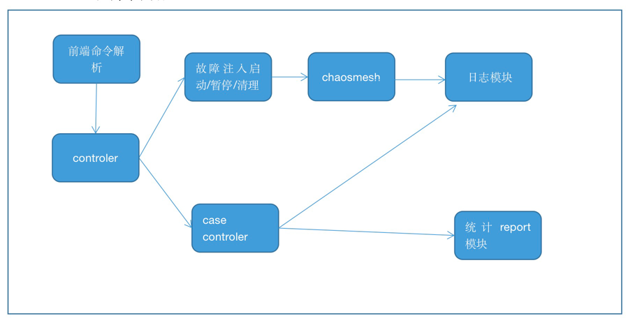
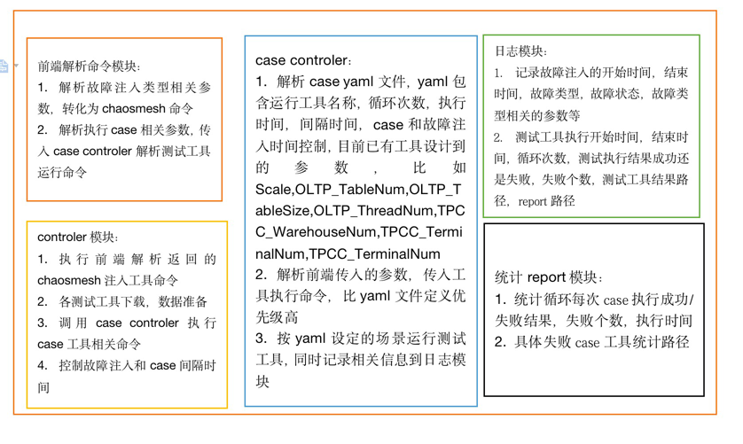

README.md# 架构设计目标
1.故障注入启动，暂停，恢复环境操作（chaosmesh已具备该功能，如果同时运行case，工具需要设计case的启动/停止,终端命令区分只终止故障，故障和case都停止操作） 

2.yaml定义故障类型，故障注入方式，多种类型故障混合，定时任务，指定节点等故障场景（使用chaosmesh工具） 

3.故障注入同时指定执行case（已有的测试工具里的case），也可以只注入故障不执行case（比如只注入故障，是否能正常拉起pod），自定义case yaml文件指定已有的case工具，执行次数，执行总时间，对应工具的参数比如tpch量级等

4.日志记录包含故障注入的开始时间，结束时间，故障类型，故障状态，故障类型相关的参数等；case记录工具测试的起始时间，结束时间，执行第几次，case成功/失败个数

5.统计case执行成功/失败结果，case执行时间report --性能监控，记录数据入库（后期再考虑）

6.mo环境准备，检测是否启动，否则自动启动环境

# 架构图

# 各模块内部功能

